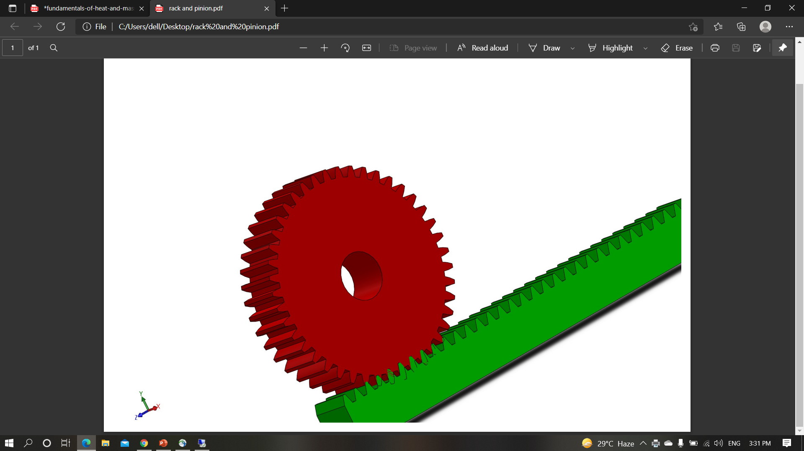
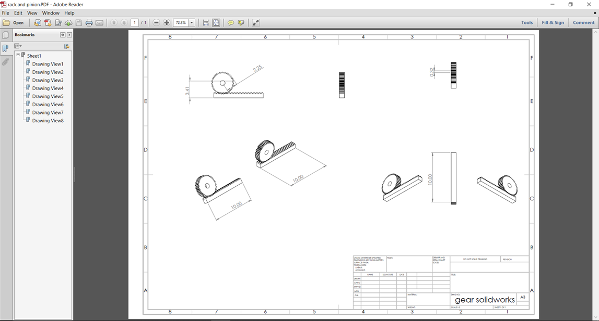

# Theory

## Principle
- The principle involved is Convert POTENTIAL ENERGY TO ELECTRICAL ENERGY CONVERSION.

- There is a system to generate power by converting the potential energy generated by a vehicle going up on a speed breaker into kinetic energy

- When the vehicle  moves over the inclined plates, it gains height resulting in increase in potential energy , which is wasted in a conventional rumble strip

## Rack and Pinion Mechanism
  
\

Rack and pinion gears normally change rotary motion into linear motion, but sometimes we use them to change linear motion into rotary motion. They transform a rotary movement (that of the pinion) into a linear movement (that of the rack) or vice versa. We use them for sliding doors moved by an electric motor.The rack is attached to the door and the pinion is attached to the motor. The motor moves the pinion which moves the rack and the door moves.

## Electricity Generation from Rack and Pinion Mechanism (Power hump)
- The Kinetic energy of moving vehicles can be converted into mechanical energy of the shaft through rack and pinion mechanism. This shaft is connected to the electric dynamo and it produces electrical energy proportional to traffic density. This generated power can be regulated by using zener diode for continuous supply .All this mechanism can be housed under the dome like speed breaker, which is called **hump**

- The generated power can be used for *general purpose like streetlights, traffic signals. The electrical output can be improved by arranging these power humps in series this generated power can be amplified and stored by using different electric devices. The maintenance cost of hump is almost nullified. By adopting this arrangement, we can satisfy the future demands to some extent*